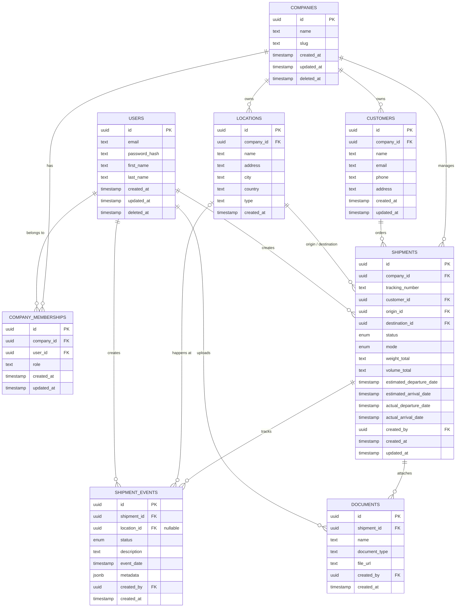

# Database Architecture (ERD)

This document maps out the core data models and relationships for the LogiFlow database.

## Entity Relationship Diagram

## Description
- **Multi-tenant Architecture:** Mọi dữ liệu lõi (`customers`, `locations`, `shipments`) đều bắt buộc phải gắn với một `company_id`.
- **Role-Based Access:** Quyền hạn (Admin, Logistic, v.v.) được gắn qua bảng `company_memberships`.
- **Shipments Lifecycle:** Một Lô hàng (`shipments`) sẽ có nhiều sự kiện (`shipment_events`) và tài liệu đính kèm (`documents`).
